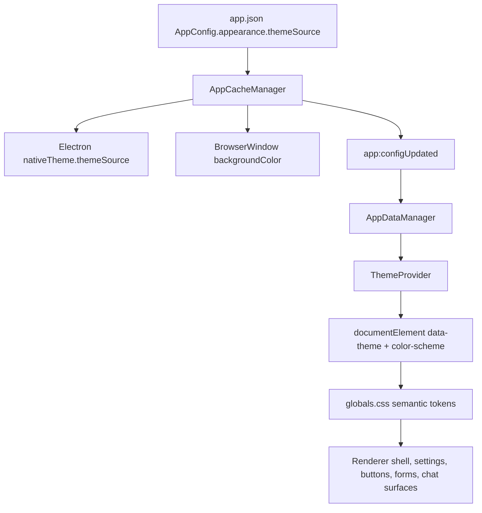

# Dark Mode Technical Design

## Current State

The design system already has the correct structural foundation for dark mode:

- Color primitives and radius values live in `src/renderer/styles/globals.css` `@theme`.
- Semantic aliases live in `:root` and are documented as the future dark-mode override point.
- `tailwind.config.js` no longer owns color values.
- `docs/design-system/README.md` and `ai.prompt/design-system.md` define the token-first governance model.
- Before this work, the app was documented as supporting only the light appearance, and there were a few incidental `dark:` classes in feature components.

The implementation therefore extends the semantic tier instead of changing primitive ramps or adding broad `dark:` utilities.

## Architecture



## Data Model

Add an app-level appearance config:

```ts
export type ThemeSource = 'light' | 'dark' | 'system';

export interface AppearanceConfig {
  themeSource: ThemeSource;
}
```

`DEFAULT_APP_CONFIG.appearance.themeSource` is `light`.

This belongs in app-level `app.json` because appearance is a device/app preference, like zoom level and sidebar layout, and should not change when users switch profiles.

## Main Process

`AppCacheManager` owns the field:

1. Add defaults and type guards in `types/app.ts`.
2. Fill/merge defaults in `integrityEnsure`.
3. Sanitize invalid values in `appConfigSanitize`.
4. Deep-merge partial appearance updates in `updateConfig`.
5. Apply `nativeTheme.themeSource` after initialization and after successful writes.
6. Apply the main `BrowserWindow` background color from the effective theme after initialization, when the window is bound, after appearance writes, and after nativeTheme `updated` events for `system` mode. This colors the macOS hidden titlebar / traffic-light strip, which is outside the renderer DOM.

The native-theme and window-background writes are synchronous and non-blocking. They must not add await work to critical startup or sign-in paths.

## Renderer

Add a small `ThemeProvider` near the top of the renderer tree:

- Reads the current `appearance.themeSource` from `appDataManager`.
- Subscribes to app config pushes.
- Resolves `system` through `window.matchMedia('(prefers-color-scheme: dark)')`.
- Writes:
  - `document.documentElement.dataset.theme = 'light' | 'dark'`
  - `document.documentElement.style.colorScheme = 'light' | 'dark'`

The provider renders children immediately and updates the root attributes as config becomes available.

## Tailwind Strategy

Use Tailwind v4's selector variant:

```css
@custom-variant dark (&:where([data-theme="dark"], [data-theme="dark"] *));
```

This makes existing `dark:` classes deterministic and tied to the app theme source. It avoids the current risk where a component could follow OS dark mode while the rest of the design system remains light.

New work should still prefer semantic tokens over `dark:` utility pairs. `dark:` is acceptable only for localized, non-tokenized exceptions during migration.

## Token Strategy

Keep primitive ramps stable and theme only semantic/component tokens:

- Text: `--color-text-default`, `--color-text-muted`, `--color-text-subtle`
- Surfaces: `--color-bg-app`, `--color-bg-muted`, `--color-bg-sidebar`, `--color-surface-*`
- Borders: `--color-border-*`
- Status surfaces: `--color-danger-surface`, `--color-success-surface`, `--color-warning-surface`, `--color-info-surface`
- Buttons: `--button-primary-*`, `--button-secondary-*`, `--button-icon-*`
- Forms: `--form-control-*`
- Stateful controls: radio and checkbox accents, plus toggle checked tracks, use accent tokens in dark mode so selected state remains visually distinct on dark surfaces. Shared settings toggles must use `.toolbar-toggle-wrapper` and `.toolbar-toggle-track`; page-specific copies are not a shared control contract and can miss dark token fixes.
- Shared accent badges such as `ExperimentTag` keep their Light `primary-500` visual, but expose a class hook for dark-only remapping to a darker primary step so white text meets contrast requirements.
- Chat chrome: Agent list search, header badges/actions, composer buttons/selectors, and dropdowns must follow the same dark polarity rule as other controls: dark surfaces with light text/icons, unless they are deliberate primary CTA tokens.
- Shared inline SVG chrome: page headers and action buttons must not leave visible SVG `fill`/`stroke` paint on primitive warm/dark ramps in dark mode. Shared header CSS maps those paints through the current header/action color so all pages using `.unified-header` inherit the same icon contrast fix.
- Onboarding/FRE chrome: inline layout styles must reference `--fre-welcome-*` / `--fre-setup-*` semantic variables instead of fixed light gradients, white cards, or fixed warm text colors.
- Startup/auth chrome: startup validation, sign-in, auto-login, data-loading, and startup-update screens must use dark-only overrides for page gradients, cards, and utility-class text. These routes are transient, so their audit coverage must capture them before authentication or startup navigation advances.
- Route/page chrome: the real visual audit owns an explicit coverage manifest that maps each `AppRoutes` page component and required transient state to one or more capture names. The manifest is part of the dark-mode contract; adding a renderer page route or important overlay requires adding a capture or intentionally documenting why it is out of scope.
- Component-state chrome: route coverage must seed important status variants, not only page shells. The MCP/Skills audit data must include connected servers with rendered tool-count badges so low-contrast status and count chips cannot hide behind a disconnected-only fixture.
- Legacy utility classes: while component migration is still in progress, dark mode includes a final cascade guard for common light-only utility classes such as `bg-white`, `bg-warm-50`, `bg-neutral-100`, `text-neutral-900`, and related border utilities. This guard is dark-only and exists to prevent late utility/global declarations from reintroducing light surfaces in app chrome.
- Shadows: `--shadow-*`

Light values must preserve the pre-dark-mode visual output. Dark values are defined under `[data-theme="dark"]` so theme support does not restyle the default Light experience.

## Initial Implementation Slice

The first slice includes:

1. App-level preference storage and validation.
2. Electron native theme sync.
3. Renderer `ThemeProvider`.
4. Settings > Appearance UI.
5. `data-theme` driven `dark:` variant.
6. Dark semantic/component tokens for:
   - document/body background
   - global glass surfaces
   - shared buttons
   - shared form controls
   - shared headers/content containers
   - shared settings cards and selects
   - left navigation background

## Deferred Migration

After the first slice, migrate feature surfaces in batches:

1. Chat message bubbles and markdown prose.
2. MCP and Skills list/detail views.
3. Agent editor tabs.
4. UserTask surfaces that already contain incidental `dark:` classes.
5. Overlay/file/image viewers.
6. Screenshot-specific annotation chrome.

Each batch should convert primitive surface utilities or fixed rgba values to semantic tokens and add/adjust tests for changed source files.

## Development Governance

Dark-mode implementation must follow `docs/dark-mode-governance.md`.

- Preserve the Light baseline by default. Light values in `:root` must keep the pre-dark-mode output unless the PR intentionally changes Light UX and updates the PRD / Tech Doc.
- Prefer semantic/component tokens over new `dark:` utility branches. Use `dark:` only for localized migration exceptions that still follow `[data-theme="dark"]`.
- Keep warning/success/danger state backgrounds and borders behind semantic tokens. `check:dark-mode` rejects PR-added raw status `rgba(...)` literals under `src/renderer`.
- Fix shared controls at their shared hook or primitive instead of patching only the page where a visual issue was found.
- Treat startup/auth/update/FRE screens, profile menus, side panes, dropdowns, badges, and shared SVG icon states as first-class audit targets, not as incidental page details.
- Keep PRD, Tech Doc, design-system docs, module `ai.prompt.md` files, the public review checklist, and CI gates synchronized when the dark-mode contract changes.

## Test Plan

- Unit test app config defaults, validation, sanitize, deep merge, nativeTheme sync, and BrowserWindow background sync.
- Unit test `ThemeProvider` resolution for Light, Dark, System, app config pushes, and media-query changes.
- Unit test Appearance settings selection and error handling.
- Update App, AppRoutes, and SettingsNavigation coverage tests for the new provider/route/item.
- Run a real Electron visual audit in an isolated `OPENKOSMOS_TEST_USER_DATA_PATH` with `appearance.themeSource = "dark"`. The audit must visit actual protected routes and fail on both low text contrast and light-surface polarity leaks, including page root wrappers such as Voice Input that may sit outside the shared `.content-view-container`. It must also run independent startup/auth scenarios before injecting auth so transient entry screens are rendered: startup validation, sign-in, auto-login "Signing In", data loading, and FRE Setting Up.
- The audit route inventory must be manifest-driven from `AppRoutes` and fail on missing coverage. The current required route/state classes include all public wrappers, `AgentPage`, `ChatView`, every Agent creation route, every Agent Settings tab/state, `SettingsPage`, every Settings child route including the embedded Browser, plus required transient states such as User Profile menu, Agent Memory sidepane, Scheduled runs sidepane, and Current Session Sub-Agent Tasks sidepane.
- The real audit must combine DOM computed-style checks with screenshot pixel checks. A page can pass only when there are no detected white DOM surfaces, no low-contrast text, no low-contrast unified-header icon paint, no toggle failures, no missing route/state captures, and no large near-white screenshot regions.
- Run:
  - `npm run check:impact -- <changed-files>`
  - `npx vitest run` for changed module tests
  - `npm run check:design`
  - `npm run check:dark-mode`
  - `npm run typecheck`
  - `npm run build:vite`

## Review Checklist

- No component adds new raw hex, unmanaged color literals, or raw status `rgba(...)` state colors.
- No `dark:` class is introduced as a substitute for a missing semantic token.
- New app config field is wired into all `AppCacheManager` hardcoded object-field sites.
- Default remains Light.
- `system` follows OS changes at runtime.
- `nativeTheme.themeSource` stays in sync with persisted preference.
- The macOS hidden titlebar uses the effective dark background instead of retaining the light Electron window background.
- Design-system docs reflect the new theme contract.
- The development and public review contracts in `docs/dark-mode-governance.md` remain accurate for any new dark-mode development, CI, or review rule.
